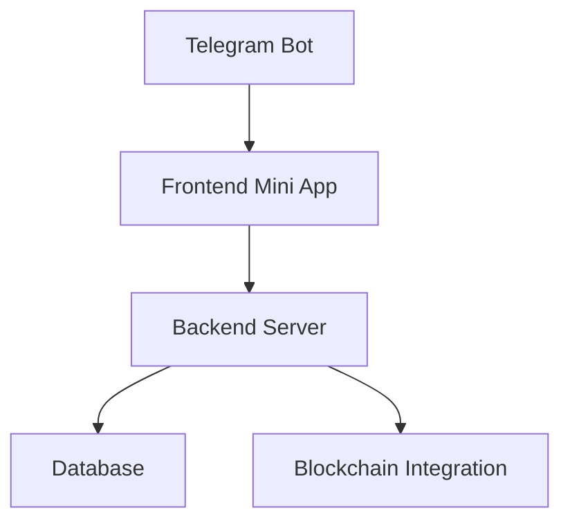
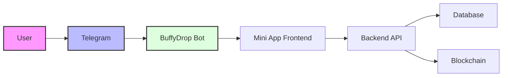
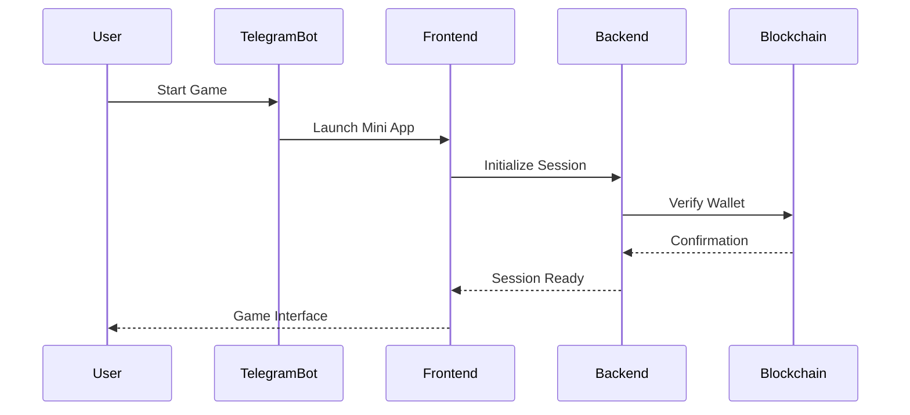

# BuffyDrop 🎮

BuffyDrop is an interactive Telegram Mini App game that combines engaging gameplay with blockchain technology, offering users a unique gaming experience directly within Telegram.


## 📑 Table of Contents

- [Overview](#overview)
- [System Architecture](#system-architecture)
- [Features](#features)
- [Technology Stack](#technology-stack)
- [Project Structure](#project-structure)
- [Installation](#installation)
- [Development](#development)
- [Deployment](#deployment)
- [Security](#security)
- [Contributing](#contributing)
- [License](#license)

## Overview

BuffyDrop is a modern gaming platform that leverages Telegram's Mini App functionality to provide users with an immersive gaming experience. The project consists of three main components:



## System Architecture

### High-Level Architecture



### Component Interaction



## Features

### Core Features

1. 🎮 Interactive Gaming Experience
   - Real-time gameplay
   - Dynamic animations
   - Responsive controls

2. 🔐 Secure Authentication
   - Telegram authentication
   - Wallet integration
   - Session management

3. 💰 Token Integration
   - Cryptocurrency support
   - Wallet management
   - Transaction history

4. 🏆 Rewards System
   - Achievement tracking
   - Leaderboard
   - Daily rewards

### Technical Features

1. Frontend
   - React-based Mini App
   - Responsive design
   - WebGL animations
   - State management with Redux

2. Backend
   - RESTful API
   - WebSocket support
   - Caching system
   - Rate limiting

3. Blockchain Integration
   - Smart contracts
   - Token management
   - Transaction verification

## Technology Stack

### Frontend
- React
- TypeScript
- Redux Toolkit
- Tailwind CSS
- Pixi.js
- Socket.io Client

### Backend
- Node.js
- Express
- MongoDB
- WebSocket
- Redis

### Blockchain
- TON Connect
- Smart Contracts
- Wallet Integration

### DevOps
- Docker
- GitHub Actions
- Vercel
- MongoDB Atlas

## Project Structure

```
BuffyDrop/
├── BuffyDrop-Frontend/
│   ├── public/
│   ├── src/
│   │   ├── components/
│   │   ├── pages/
│   │   ├── store/
│   │   ├── hooks/
│   │   └── utils/
│   ├── package.json
│   └── vite.config.ts
├── BuffyDrop-Backend/
│   ├── src/
│   │   ├── controllers/
│   │   ├── models/
│   │   ├── routes/
│   │   └── services/
│   ├── package.json
│   └── tsconfig.json
└── bot.py
```

## Installation

### Prerequisites

- Node.js (v16+)
- Python 3.8+
- MongoDB
- Redis

### Frontend Setup

```bash
cd BuffyDrop-Frontend
npm install
npm run dev
```

### Backend Setup

```bash
cd BuffyDrop-Backend
npm install
npm run dev
```

### Bot Setup

```bash
python -m venv venv
source venv/bin/activate  # or `venv\Scripts\activate` on Windows
pip install -r requirements.txt
python bot.py
```

## Development

### Environment Variables

```env
# Frontend
VITE_API_URL=http://localhost:3000
VITE_WS_URL=ws